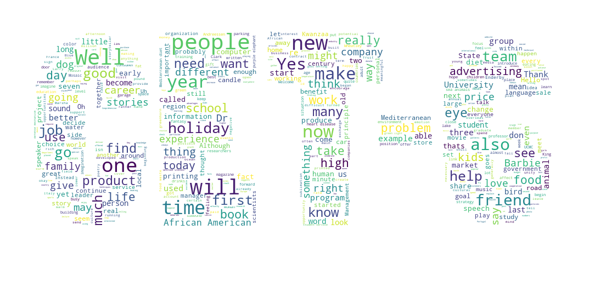
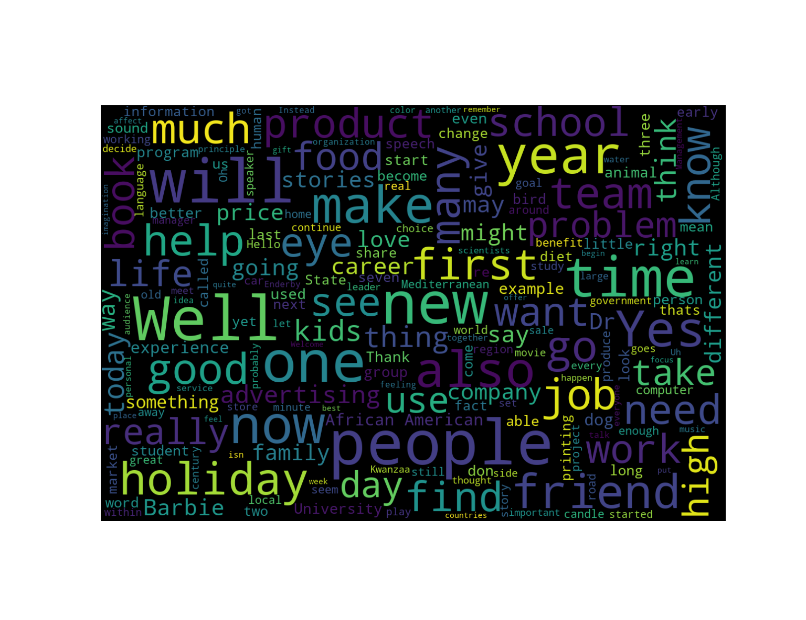

# cet6-listening-part-words

  
  2015-12 至 2017-12 CET 6 听力部分高频单词。

## 部分高频词汇

| 序号  | 字词     | 出现次数 | 出现频率   |
| :--- | :----- | :--- | :----- |
| 39	 |	people|	36		|0.2994|
| 44	 |  will	|	33		|0.2744|
| 78	 | friends|	18		|0.1497|
| 94	 |  job		| 15		|0.1247|
| ...  |  ...   | ...  	| ...  |

详细词频请看 [word_frequency.txt](word_frequency.txt)。

## 支持？

`star ⭐` 一下就好。
